# Refactoring Horiseon Web page

### Description

This project's goal was to refactor the html and css code to allow for more accessibility and dryer code.

### User Story

```
AS A marketing agency
I WANT a codebase that follows accessibility standards
SO THAT our own site is optimized for search engines
```

### Refactor Highlights

In this section I will be highlighting some of the refactoring I have done to make the web page more accessible and the css dryer

- This was the code before refactor

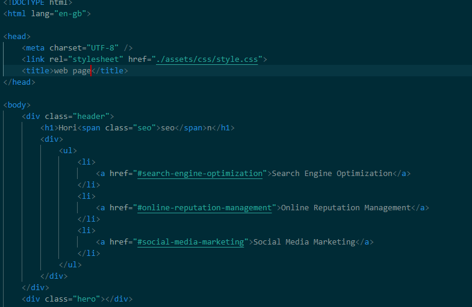

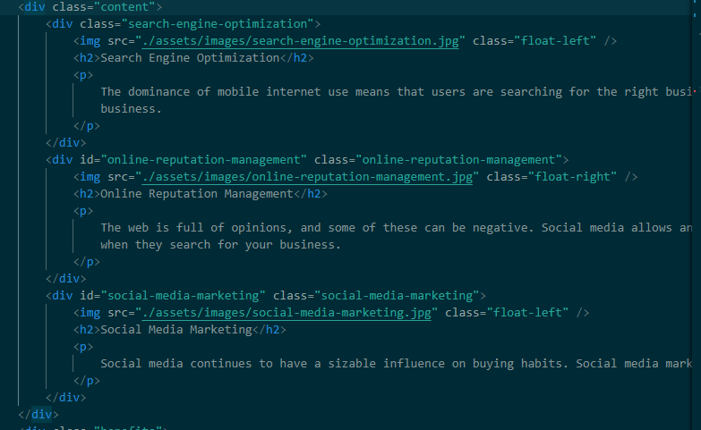

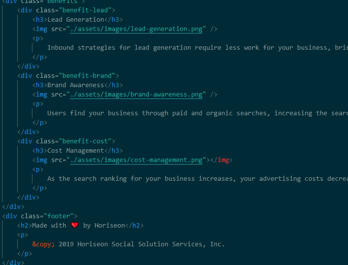

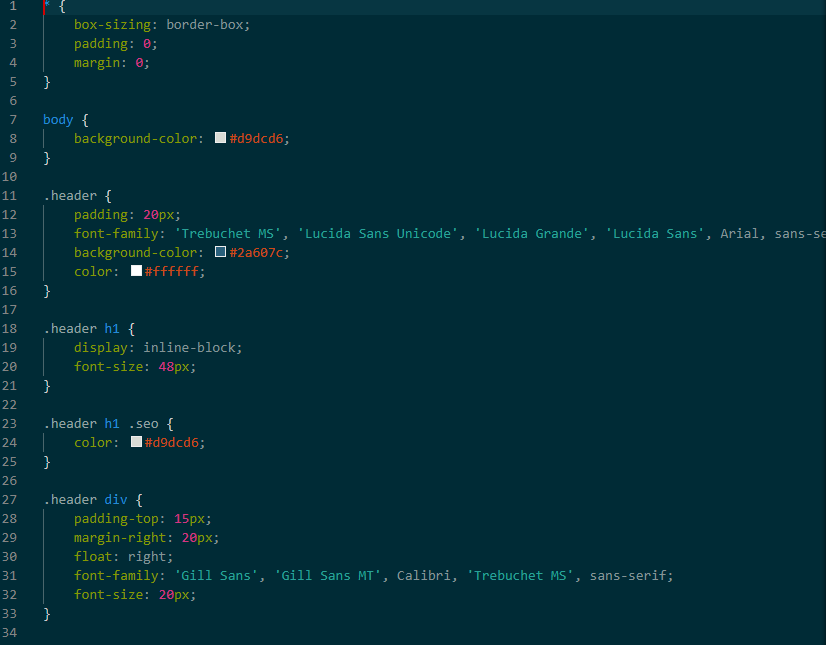

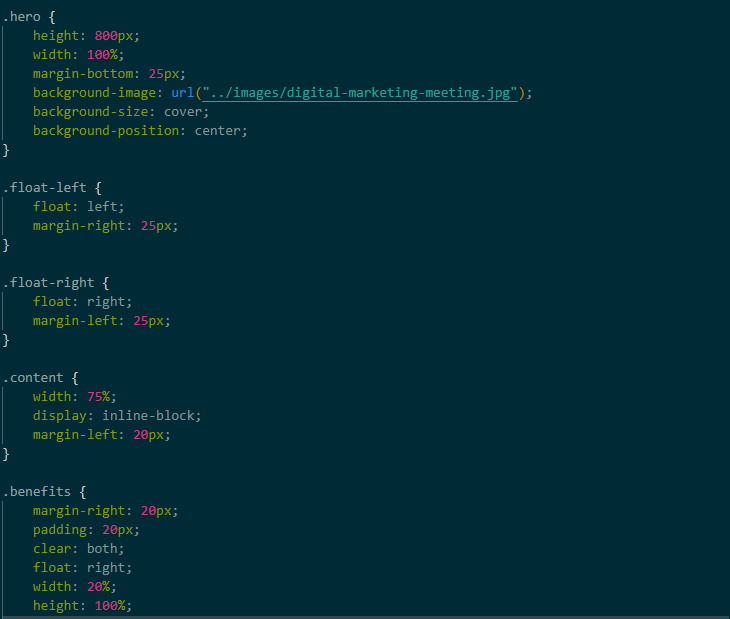

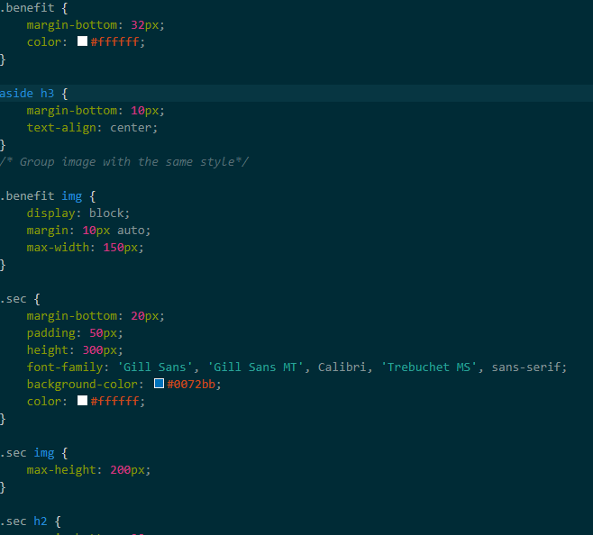

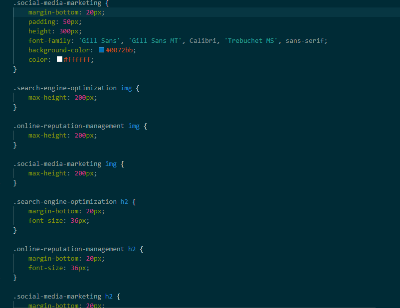


- This is the code after refactor

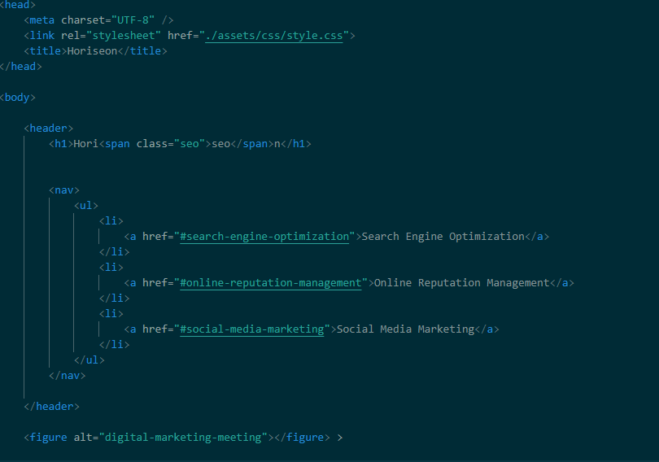

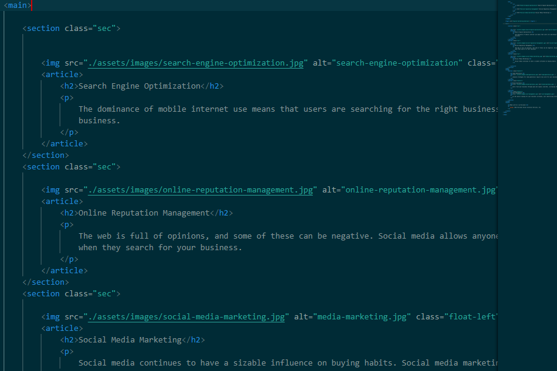

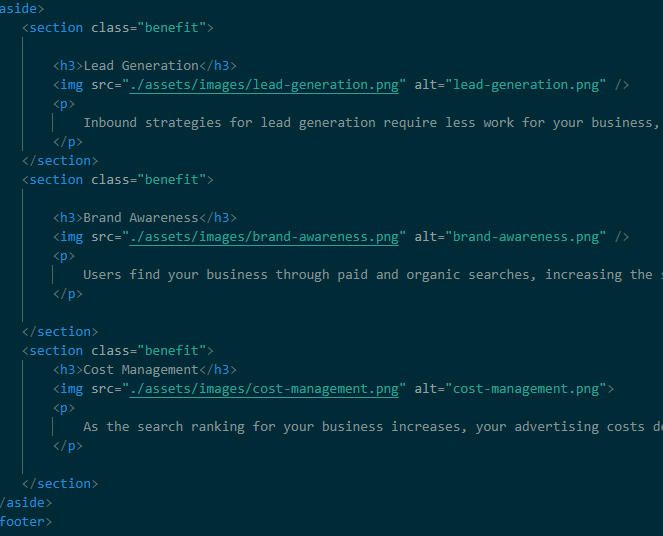


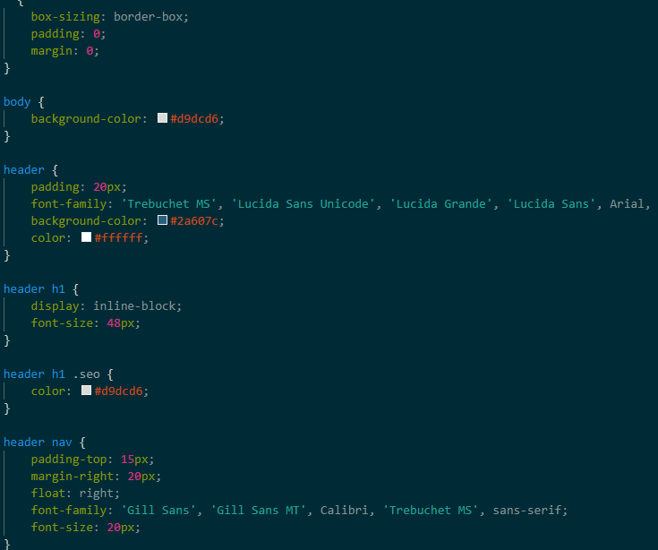

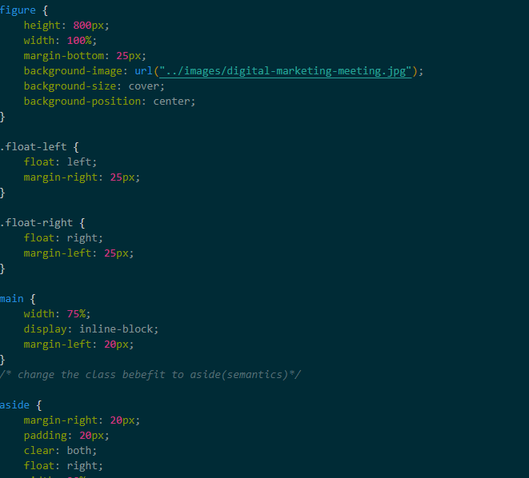


### Change was effected to Horiseon Web page for better accessibility as thus:

- Header
- Figure
- Main
- Section
- Article
- Aside
- footer

### Author

This project was refactor by Salisu Isah
